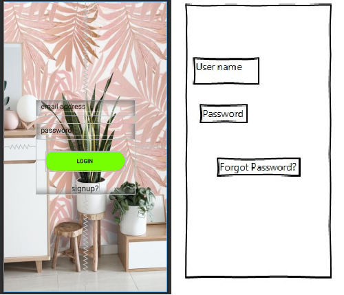

# employees_management_system

 

## Wireframes

<table>
    <tr>
        <td>
            
        </td>
        <td>
            
        </td>
		<td>
            
        </td>
        <td>		    
            
        </td>
		<td>		    
            
        </td>
		<td>		    
            
        </td>
    </tr>
</table>

  

<b>this will be removed by time</b>

<h1>IF WE DONT COMMUNICATE AND COOPARATE THEN WE WILL NOT GET TO OUR GOALS</h1>
<h4>what is missing</h4>

more wireframes are nneded to accomplish <b>Policy document</b>, <b>Leaves</b> and  <b>Home</b>

<h2>ALL UI ACTIVITIES ARE TO BE LEFT FOR PETER MESHACK</h2>

only after a proper wireframes are presented

<h2>Cooncern</h2>
	
How comes the app hairun kwa phone natumia. Am asking here ju sina access ya whatsapp

